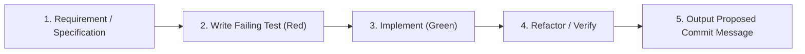

# Test-Driven Development (TDD) Skill

This skill guides you through implementing features and fixes using a disciplined Test-First workflow.

---

## 5-Step TDD Workflow



### Step 1: Requirement / Specification
- Identify input contracts, output contracts, and mathematical formulas.
- Enumerate edge cases: zero values, negative balances, missing exchange rates, split payments, and database constraints.

### Step 2: Write Failing Test (Red Phase)
- Create or update test files in `backend/tests/` or frontend test suites **before** writing application code.
- Refer to [Backend Testing Guide](./references/backend_testing_guide.md) for async DB fixture boilerplate.
- Run the targeted test to confirm it fails on the missing capability or reproduces the bug:
  ```bash
  PYTHONPATH=backend /home/jayampatel/swe/greenline/backend/.venv/bin/pytest backend/tests/test_your_feature.py -v
  ```

### Step 3: Implement (Green Phase)
- Write the minimal, cleanest application logic necessary to satisfy the test assertions.
- Re-run the targeted test to confirm it passes.

### Step 4: Refactor / Verify
- Clean up duplicate code and optimize queries without changing behavior.
- Execute full test suites, type checking, and linters to verify zero regressions:
  ```bash
  PYTHONPATH=backend /home/jayampatel/swe/greenline/backend/.venv/bin/pytest backend/tests
  cd frontend && npx tsc --noEmit && npm run lint
  ```
- Always present test execution output in the turn response.

### Step 5: Output Proposed Commit Message
- Whenever repository or workspace files have been created, modified, renamed, or deleted, append the proposed commit message as a dedicated trailing block at the very end of your final response:
  ```text
  Commit Message:
  <type>(<scope>): <imperative summary>
  ```
- Omit the trailer for conversational responses, planning turns before approval, and read-only operations.
- Refer to [Conventional Commit Skill](../conventional-commit/SKILL.md) for commit types and scopes.

---

## Reference Guides

- [Backend Testing Guide](./references/backend_testing_guide.md): In-memory async SQLite fixtures, API client overrides, and engine testing patterns.
- [Frontend Testing Guide](./references/frontend_testing_guide.md): Component tests, TypeScript validation, and Playwright E2E scenarios.
