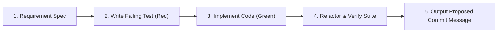

# Test-Driven Development (TDD) Skill

This skill guides you through implementing features and fixes using a disciplined Test-First workflow.

---

## 5-Step TDD Workflow



### Step 1: Requirement & Test Specification
- Identify input contracts, output contracts, and mathematical formulas.
- Identify edge cases: zero amounts, negative balances, missing exchange rates, split payments.

### Step 2: Write Failing Tests First (Red Phase)
- Create or update the test file in `backend/tests/` or `frontend/`.
- Refer to [Backend Testing Guide](./references/backend_testing_guide.md) for async DB fixture boilerplate.
- Run the single test file to confirm it fails:
  ```bash
  PYTHONPATH=backend /home/jayampatel/swe/greenline/backend/.venv/bin/pytest backend/tests/test_your_feature.py -v
  ```

### Step 3: Implement Minimal Code (Green Phase)
- Write the minimal application logic to satisfy the test assertions.
- Re-run the test to confirm it passes.

### Step 4: Refactor & Full Suite Verification
- Clean up duplicate logic and formatting.
- Execute full test suite and typecheck:
  ```bash
  PYTHONPATH=backend /home/jayampatel/swe/greenline/backend/.venv/bin/pytest backend/tests
  cd frontend && npx tsc --noEmit
  ```

### Step 5: Output Proposed Commit Message
- Whenever files are created or modified, append the mandatory commit message trailer at the very end of your reply:
  ```text
  Commit Message:
  <Commit message to use>
  ```

---

## Reference Guides

- [Backend Testing Guide](./references/backend_testing_guide.md): In-memory async SQLite fixtures, API client overrides, and engine testing patterns.
- [Frontend Testing Guide](./references/frontend_testing_guide.md): Component tests, TypeScript validation, and Playwright E2E scenarios.
