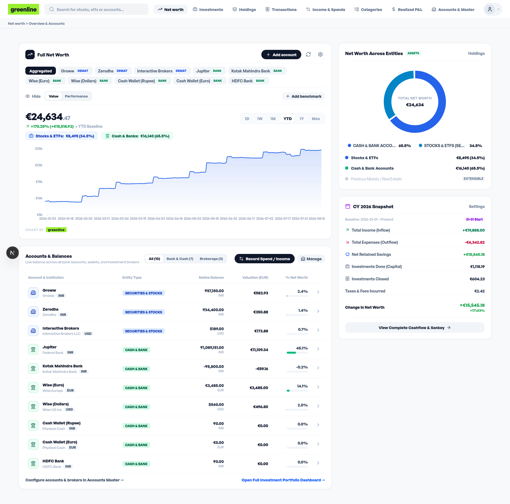
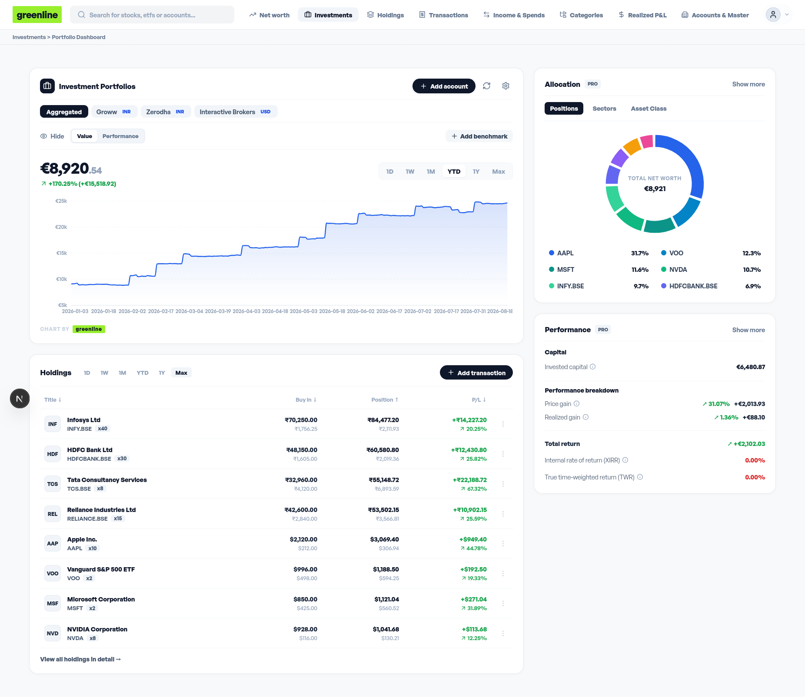
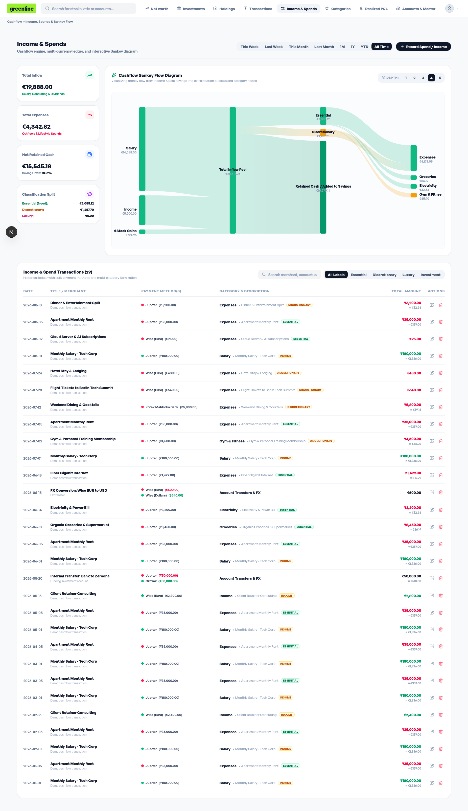
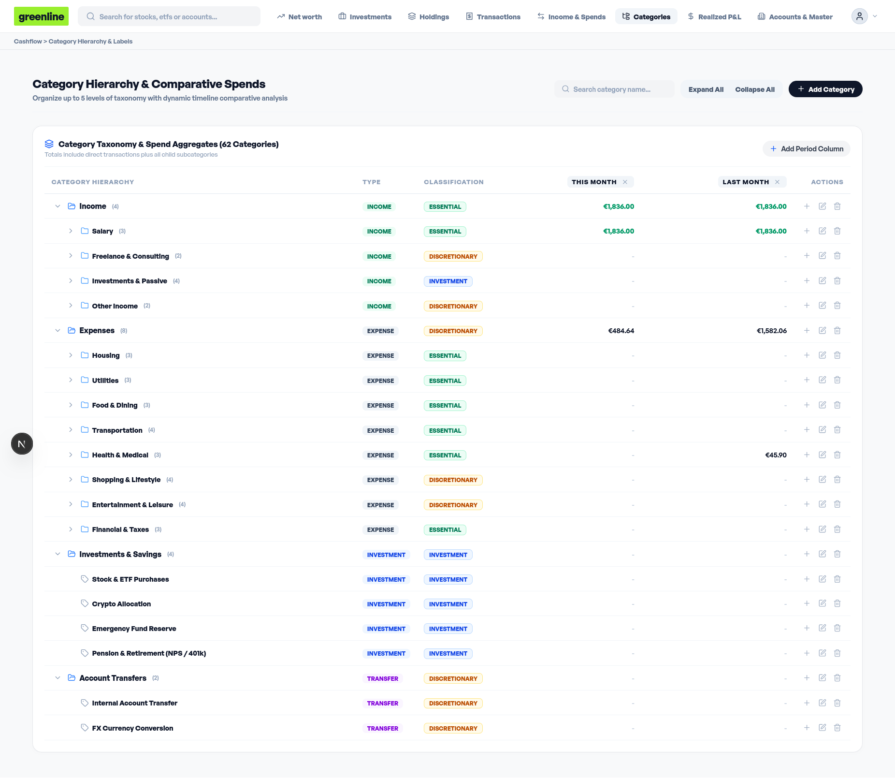
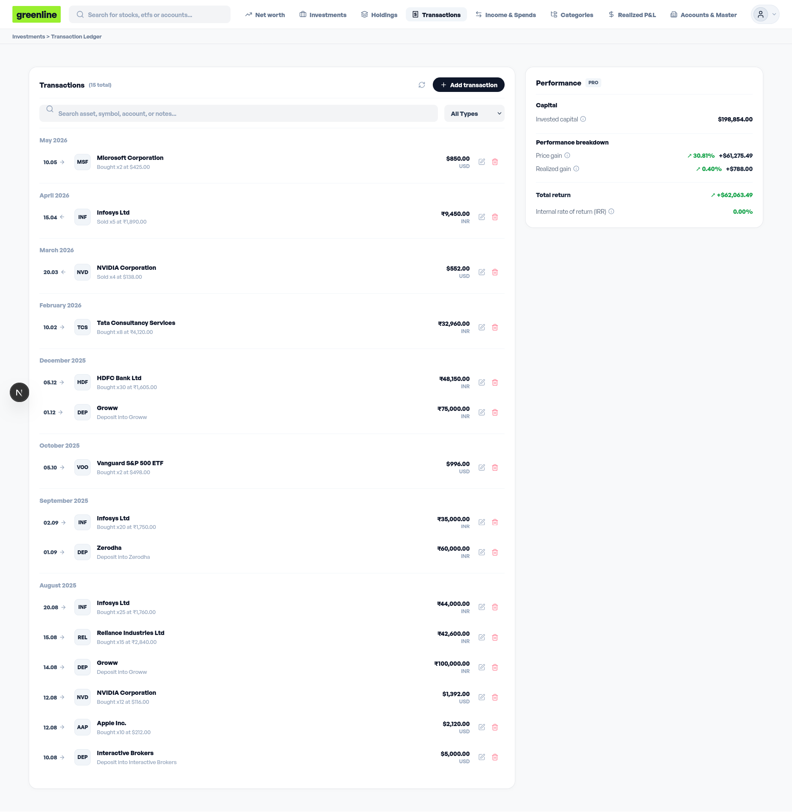
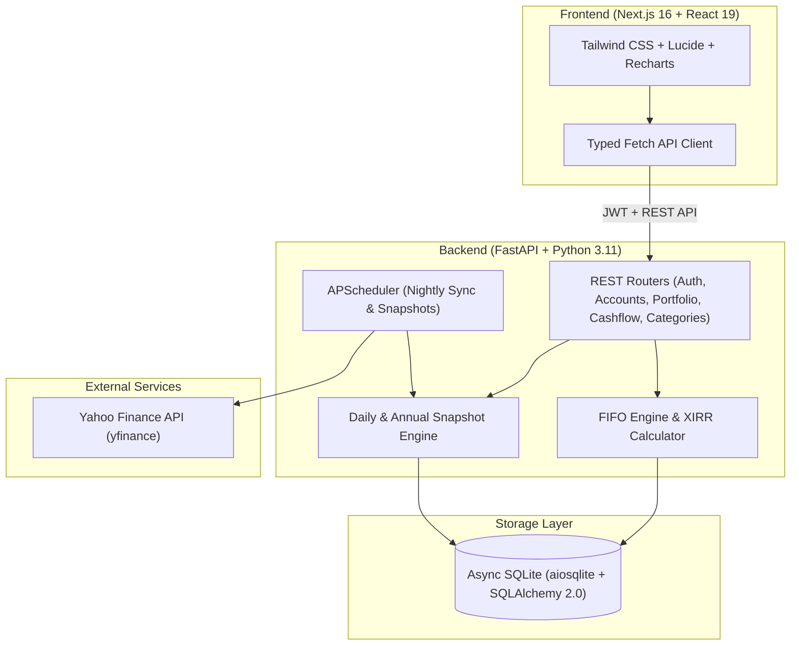

<div align="center">

# 🌿 Greenline

**Self-Hosted, Privacy-First Investment & Multi-Account Portfolio Tracker**

An elegant, real-time personal finance and investment analytics platform designed to aggregate multi-currency portfolios across brokerages, demat accounts, crypto wallets, and bank accounts. Features strict **FIFO cost lot accounting**, annualized **XIRR / TWR return tracking**, dynamic **Cashflow Sankey modeling**, **hierarchical spend taxonomy**, live **market price synchronization**, and **market benchmark overlays**.

[](https://nextjs.org/)
[](https://react.dev/)
[](https://fastapi.tiangolo.com/)
[](https://python.org/)
[](https://www.docker.com/)
[](https://opensource.org/licenses/MIT)

</div>

---

## 📸 Interface Showcase

### 1. Unified Net Worth & Multi-Account Dashboard
Track marked-to-market valuations across individual accounts or aggregated across your entire net worth in a unified master currency (EUR). Switch seamlessly between **Value** and **Performance (P&L %)** modes, view interactive entity allocation donuts, and track calendar-year cashflow snapshots alongside live liquid cash vs securities breakdown.



---

### 2. Investment Portfolio Analytics & Asset Allocation
Dedicated portfolio dashboard offering deep capital breakdowns (Invested Capital, Price Gain, Realized Gain, Total Return, XIRR, and TWR). Visualize portfolio diversification with 3-way toggle allocation rings across **Individual Positions**, **Economic Sectors**, and **Asset Classes** (Equities, ETFs, Crypto, Cash).



---

### 3. Positions & Tax-Lot FIFO Holdings Ledger
Deep-dive into active positions with 2-line Unrealized and Realized P&L breakdowns, annualized XIRR metrics, sorting across every column, and expand open FIFO cost lots with full buy-date granularity and unit cost basis (incorporating acquisition fees and taxes). Fully liquidated securities automatically move to a dedicated **Closed Positions** ledger.


---

### 4. Interactive Cashflow & Sankey Flow Engine
Visualize how money moves from all income sources through classification tiers (**Essential**, **Discretionary**, **Luxury**, **Investment**) down to specific subcategories. Features multi-account split payment methods, multi-category line-item itemization, negative value adjustments (reimbursements/splits), and flexible timeframe filters (This Month, Last Month, YTD, All Time).



---

### 5. 5-Level Category Taxonomy & Multi-Period Comparative Spends
Organize your financial life into a flexible category hierarchy spanning **Income**, **Spends**, **Investments & Savings**, and **Account Transfers**. Compare expenses across dynamic timeframes (This Month vs. Last Month vs. Custom Periods) with automated parent-category aggregations.



---

### 6. Unified Trade & Transaction Ledger
Manage buy, sell, dividend, split, deposit, and withdrawal records. Features live typeahead security search with automatic Yahoo Finance metadata registration (ISIN, Industry, Sector, Asset Type), funding account routing, and automated FIFO tax-lot calculation.



---

### 7. One-Click Privacy & Streaming Mode
Instantly mask all net worth figures, position amounts, cash balances, and trade values when presenting in public, recording videos, or streaming screen captures.


---

## ✨ Core Features & Financial Engineering

- **💼 Comprehensive Demat & Cash Accounting**: Demat and trading accounts accurately reflect total valuation (`cash_balance + securities_value`), preventing double-counting or disconnected liquid balances.
- **🏦 Funding Account Routing**: Seamlessly fund trades and investments from external bank accounts while keeping asset holdings registered inside the target brokerage.
- **📐 Strict First-In, First-Out (FIFO) Cost-Basis Engine**: Chronologically depletes purchase lots to compute realized capital gains and remaining cost lots, fully compliant with international tax accounting standards.
- **💵 Precision Fees & Taxes Capitalization**: Purchase brokerage fees and taxes are capitalized into open lot cost basis, while sale charges are correctly factored into net realized P&L without double-deducting funded bank balances.
- **📈 Advanced Performance Metrics**:
  - **XIRR**: Annualized Internal Rate of Return calculated over real cash-flow schedules using Newton-Raphson optimization.
  - **TWR**: True Time-Weighted Return eliminating distortion from external deposits and withdrawals.
  - **P&L % Performance Mode**: Track actual profit & loss percentage curves over custom timeframes (1D, 1W, 1M, YTD, 1Y, Max).
- **⚖️ Market Benchmark Overlays**: Overlay normalized percentage returns of the **S&P 500 (`^GSPC`)**, **Bitcoin (`BTC-USD`)**, and **Nifty 50 (`^NSEI`)** directly on your portfolio chart.
- **🍩 Interactive Visualizations**: Recharts-powered asset allocation donuts, Net Worth timeline area charts, and responsive multi-depth Sankey diagrams.
- **🔒 Complete Data Sovereignty**: One-click full portfolio JSON export and restore capabilities. Your financial data stays entirely on your private hardware.

---

## 🛠️ Architecture & Tech Stack



| Layer | Technologies |
| :--- | :--- |
| **Frontend** | [Next.js 16](https://nextjs.org/) (App Router, Turbopack), [React 19](https://react.dev/), [Tailwind CSS v4](https://tailwindcss.com/), [Lucide Icons](https://lucide.dev/), [Recharts](https://recharts.org/) |
| **Backend** | [FastAPI](https://fastapi.tiangolo.com/), [SQLAlchemy 2.0](https://www.sqlalchemy.org/) (Async), [Pydantic v2](https://docs.pydantic.dev/), [APScheduler](https://apscheduler.readthedocs.io/) |
| **Database** | SQLite with [aiosqlite](https://github.com/omnilib/aiosqlite) |
| **Market Data** | Yahoo Finance ([yfinance](https://github.com/ranaroussi/yfinance)) |
| **Testing** | [Pytest](https://docs.pytest.org/), [Vitest](https://vitest.dev/), [Playwright](https://playwright.dev/) |
| **Containers** | Docker & Docker Compose (Multi-stage development & production builds) |

---

## 🚀 Quick Start with Docker

### Prerequisites
- [Docker](https://docs.docker.com/get-docker/) (v24+)
- [Docker Compose](https://docs.docker.com/compose/) (v2+)

### 1. Clone the Repository
```bash
git clone https://github.com/jayam04/greenline.git
cd greenline
```

### 2. Start in Development Mode (Live Hot-Reloading)
Spins up the Next.js Turbopack dev server and FastAPI with automatic file-watch reloads:
```bash
docker compose up -d
```

Open [http://localhost:3000](http://localhost:3000) in your browser.

- **Default Admin User**: `admin`
- **Default Password**: `admin123`
- **Backend API Docs**: [http://localhost:8000/docs](http://localhost:8000/docs)

---

### 3. Build & Start in Production Mode (Optimized Standalone)
Compiles an optimized standalone production bundle:
```bash
docker compose -f docker-compose.prod.yml up --build -d
```

### 4. Stopping Containers
```bash
docker compose down
# or for production:
docker compose -f docker-compose.prod.yml down
```

---

## 💻 Local Development Setup (Without Docker)

### Backend Setup
```bash
cd backend
python3 -m venv .venv
source .venv/bin/activate
pip install -r requirements.txt

# Run database migrations and start FastAPI server
PYTHONPATH=. uvicorn app.main:app --reload --host 0.0.0.0 --port 8000
```

### Frontend Setup
```bash
cd frontend
npm ci

# Start Next.js development server
npm run dev
```

---

## 🧪 Running Automated Tests

Greenline adheres to a strict Test-Driven Development (TDD) protocol across all layers:

### Backend Tests (Pytest)
Runs the test suite covering FIFO lot accounting, funding accounts, snapshot engines, and multi-currency valuations:
```bash
PYTHONPATH=backend pytest backend/tests
```

### Frontend Unit & Component Tests (Vitest)
Executes component tests for formatters, holdings tables, transactions ledgers, and modals:
```bash
cd frontend
npm test
```

### End-to-End Browser Tests (Playwright)
Executes full user journeys (Dashboard, Holdings FIFO expansion, Cashflow, Privacy mode):
```bash
cd frontend
npx playwright test
```

### Linting & Type Checking
```bash
# Backend linting with Ruff
ruff check backend/app backend/tests

# Frontend TypeScript check and ESLint
cd frontend
npx tsc --noEmit
npm run lint
```

---

## 📂 Project Structure

```text
greenline/
├── .github/
│   ├── data/                 # Visual showcase screenshots & assets
│   └── workflows/            # GitHub Actions CI/CD workflows
├── backend/
│   ├── app/
│   │   ├── api/              # REST routers (accounts, assets, portfolio, cashflow, categories)
│   │   ├── db/               # SQLAlchemy models, sessions, & migration engine
│   │   ├── schemas/          # Pydantic v2 request & response schemas
│   │   └── services/         # Core financial engines (FIFO, XIRR, Snapshots, Cashflow)
│   ├── tests/                # Automated pytest unit & integration tests
│   ├── Dockerfile
│   └── requirements.txt
├── frontend/
│   ├── e2e/                  # Playwright End-to-End test suites
│   ├── src/
│   │   ├── app/              # Next.js App Router pages (Dashboard, Holdings, Cashflow, etc.)
│   │   ├── components/       # Reusable UI components (Sankey, Charts, Modals, Navbar)
│   │   └── lib/              # API clients & currency formatters
│   ├── Dockerfile
│   ├── package.json
│   ├── playwright.config.ts
│   └── vitest.config.mts
├── data/                     # Persistent SQLite databases and JSON backups
├── docker-compose.yml        # Development Docker Compose (npm run dev + hot-reload)
├── docker-compose.prod.yml   # Production Docker Compose (npm start + optimized build)
├── pyproject.toml            # Python tool configurations (Ruff, Pytest)
├── .gitignore
└── README.md
```

---

## 📄 License

Distributed under the [MIT License](LICENSE).
