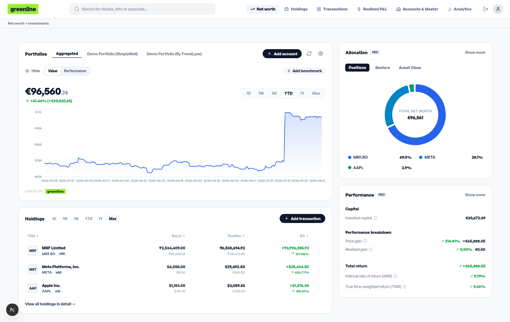
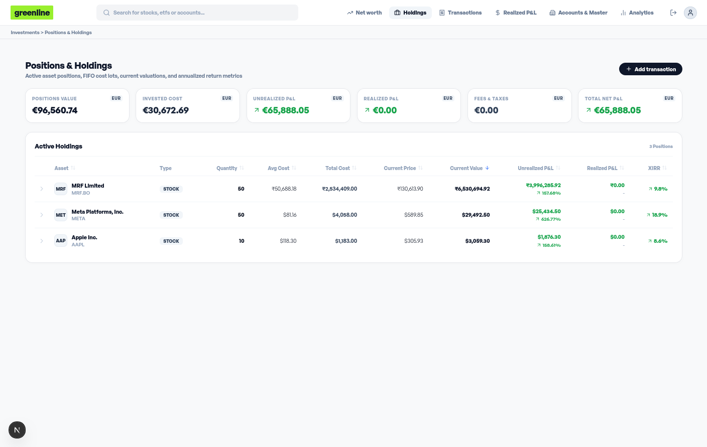
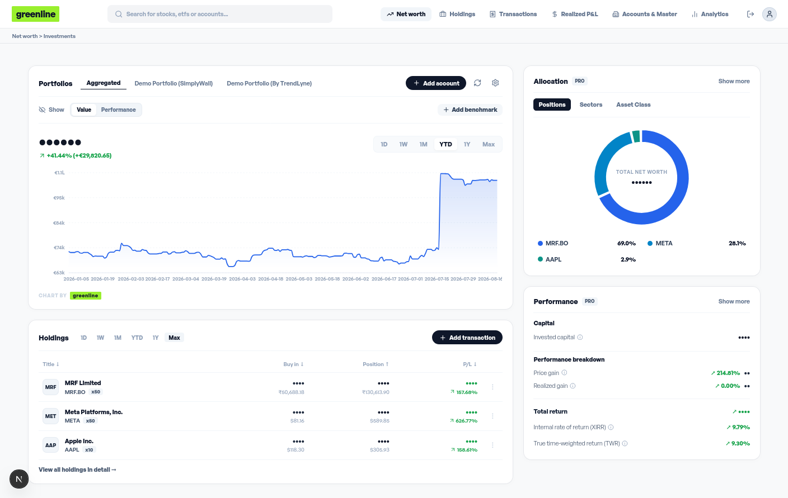
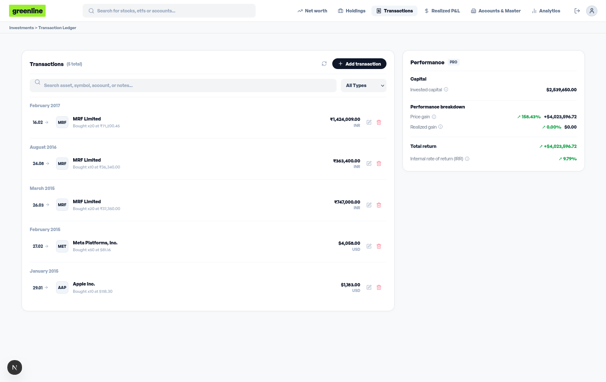
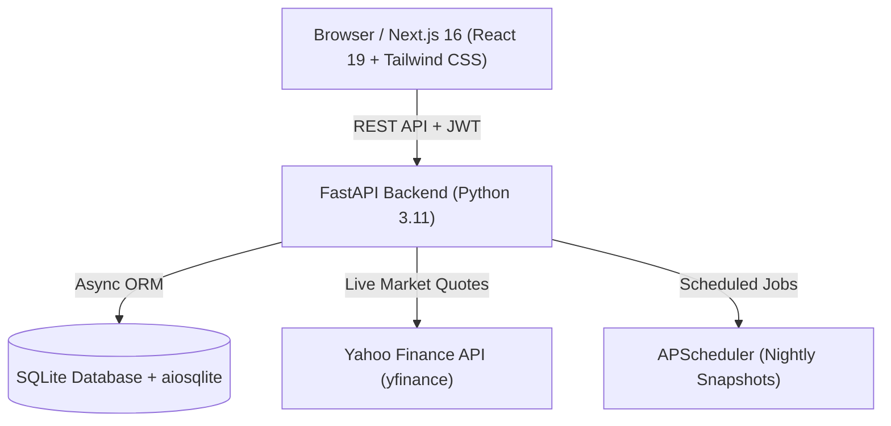

<div align="center">

# 🌿 Greenline

**Self-Hosted, Privacy-First Investment & Multi-Account Portfolio Tracker**

An elegant, real-time investment analytics platform designed to aggregate multi-currency portfolios across brokerages, demat accounts, crypto wallets, and bank accounts. Features strict **FIFO cost lot accounting**, annualized **XIRR / TWR return tracking**, live **market price synchronization**, and **market benchmark overlays**.

[](https://nextjs.org/)
[](https://fastapi.tiangolo.com/)
[](https://python.org/)
[](https://www.docker.com/)
[](https://opensource.org/licenses/MIT)

</div>

---

## 📸 Interface Showcase

### 1. Unified Net Worth & Portfolio Analytics Dashboard
Track marked-to-market valuations across individual accounts or aggregated across your entire net worth in a unified master currency (EUR). Switch seamlessly between **Value** and **Performance (P&L %)** modes, analyze asset/sector allocation donuts, and benchmark returns against S&P 500, Bitcoin, or Nifty 50.



---

### 2. Positions & Tax-Lot Holdings Ledger
Deep-dive into active positions with 2-line Unrealized and Realized P&L breakdowns, annualized XIRR metrics, sorting across every column, and expand FIFO cost lots with full buy-date granularity. Completely sold securities automatically migrate to a dedicated **Closed Positions** ledger.



---

### 3. One-Click Privacy & Focus Mode
Instantly mask all net worth figures, position amounts, cash balances, and trade values when presenting in public or streaming screen captures.



---

### 4. Comprehensive Transaction Ledger
Manage buy, sell, dividend, split, deposit, and withdrawal records. Features live typeahead security search with automatic Yahoo Finance metadata registration (ISIN, Industry, Sector, Asset Type) and multi-transaction batch entry.



---

## ✨ Key Features

- **💼 Multi-Account & Demat Aggregation**: Connect and manage multiple brokerage accounts (e.g., Zerodha, Schwab, Interactive Brokers, Crypto wallets) with independent base currencies (USD, EUR, INR, GBP, CAD, AUD).
- **🔎 Live Yahoo Finance Search & Auto-Creation**: Type any ISIN, ticker, or company name to instantly search global markets and auto-register securities with full metadata (ISIN, Industry, Sector, Asset Type, Exchange).
- **📐 Strict FIFO Cost-Basis Engine**: Accurately computes realized capital gains and remaining cost lots on partial and full sales in compliance with First-In, First-Out tax accounting.
- **📈 Advanced Performance Metrics**:
  - **XIRR**: Annualized Internal Rate of Return calculated over real cash-flow schedules using Newton-Raphson optimization.
  - **TWR**: True Time-Weighted Return eliminating distortion from external deposits and withdrawals.
  - **P&L % Performance Mode**: Track actual profit & loss percentage curves over custom timeframes (1D, 1W, 1M, YTD, 1Y, Max).
- **⚖️ Benchmark Comparisons**: Overlay normalized percentage returns of the **S&P 500 (`^GSPC`)**, **Bitcoin (`BTC-USD`)**, and **Nifty 50 (`^NSEI`)** directly on your portfolio chart.
- **🍩 Clockwise Allocation Visualizations**: Interactive asset class and sector distribution charts starting top-dead-center (90°) with clean hover tooltips.
- **🔒 Complete Data Sovereignty & Backups**: One-click full portfolio JSON export and restore capabilities. Your financial data stays entirely on your hardware.

---

## 🛠️ Architecture & Tech Stack



| Layer | Technologies |
| :--- | :--- |
| **Frontend** | [Next.js 16](https://nextjs.org/) (App Router, Turbopack), React 19, Tailwind CSS, Lucide Icons, Recharts |
| **Backend** | [FastAPI](https://fastapi.tiangolo.com/), [SQLAlchemy 2.0](https://www.sqlalchemy.org/) (Async), Pydantic v2, APScheduler |
| **Database** | SQLite with [aiosqlite](https://github.com/omnilib/aiosqlite) |
| **Market Data** | Yahoo Finance ([yfinance](https://github.com/ranaroussi/yfinance)) |
| **Containers** | Docker & Docker Compose (Multi-stage development & production builds) |

---

## 🚀 Quick Start with Docker

### Prerequisites
- [Docker](https://docs.docker.com/get-docker/) (v24+)
- [Docker Compose](https://docs.docker.com/compose/) (v2+)

### 1. Clone the Repository
```bash
git clone https://github.com/your-username/greenline.git
cd greenline
```

### 2. Start in Development Mode (Live Hot-Reloading)
Spins up the Next.js Turbopack dev server and FastAPI with automatic file-watch reloads:
```bash
docker compose up -d
```

Open [http://localhost:3000](http://localhost:3000) in your browser.

- **Default Admin User**: `admin`
- **Default Password**: `admin123`
- **Backend API Docs**: [http://localhost:8000/docs](http://localhost:8000/docs)

---

### 3. Build & Start in Production Mode (Optimized Standalone)
Compiles an optimized static production bundle:
```bash
docker compose -f docker-compose.prod.yml up --build -d
```

### 4. Stopping Containers
```bash
docker compose down
# or for production:
docker compose -f docker-compose.prod.yml down
```

---

## 🧪 Running Automated Tests

Run the complete backend test suite (covering FIFO engine calculations, snapshot generation, and XIRR analytics):
```bash
docker compose exec backend pytest /app/tests
```

---

## 📂 Project Structure

```text
greenline/
├── .github/
│   └── data/                 # Visual showcase screenshots & assets
├── backend/
│   ├── app/
│   │   ├── api/              # REST routers (accounts, assets, portfolio, snapshots, etc.)
│   │   ├── db/               # SQLAlchemy models & database session setup
│   │   ├── schemas/          # Pydantic v2 request & response schemas
│   │   └── services/         # Core financial engines (FIFO, XIRR, Snapshots, Prices)
│   ├── tests/                # Automated pytest unit & integration tests
│   ├── Dockerfile
│   └── requirements.txt
├── frontend/
│   ├── src/
│   │   ├── app/              # Next.js App Router pages (Dashboard, Holdings, Realized, etc.)
│   │   ├── components/       # Reusable UI components (Charts, Modals, Navbar)
│   │   └── lib/              # API clients & currency formatters
│   ├── Dockerfile
│   ├── package.json
│   └── next.config.ts
├── data/                     # Persistent SQLite databases and JSON backups
├── docker-compose.yml        # Development Docker Compose (npm run dev + hot-reload)
├── docker-compose.prod.yml   # Production Docker Compose (npm start + optimized build)
├── .gitignore
└── README.md
```
